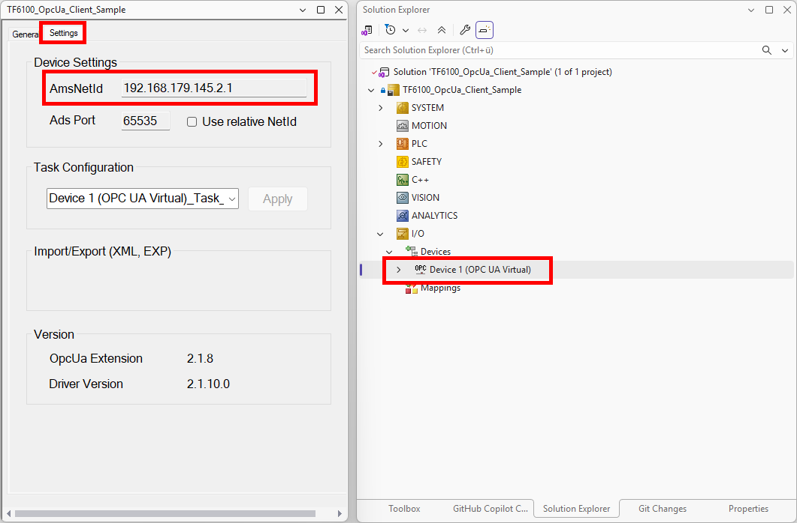
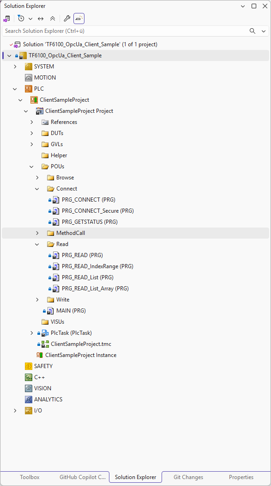

# TF6100 OPC UA Client Sample

## Overview
This TwinCAT 3 sample demonstrates how to connect a PLC project to an OPC UA server and exercise common client-side workflows. The project contains dedicated programs for browsing, connecting, reading, writing, calling methods, and working with historical access data.

## What this sample demonstrates
- Establishing an OPC UA session with the TwinCAT OPC UA Client function blocks
- Browsing the server namespace and reading node handles
- Writing scalar values and indexed ranges to server nodes
- Calling OPC UA methods with input and output arguments
- Reading and updating historical data

## Prerequisites
- TwinCAT 3 XAE engineering environment installed on Windows
- A TwinCAT 3 XAR runtime or compatible target system that can run the PLC project
- TF6100 TC3 OPC UA Client workload installation on your target system
- TF6100 OPC UA license for the target runtime
- Network access to the target server, plus a trusted server certificate for secure connections

Please note that the TF6100 TC3 OPC UA Client workload will also install the `TwinCAT OPC UA Sample Server`, which is used by these samples.

## Getting Started
1. Start the `TwinCAT OPC UA Sample Server`, which you can find on the Windows start menu.
2. Open the solution file [TF6100_OpcUa_Client_Sample.sln](TF6100_OpcUa_Client_Sample.sln).
3. Navigate to `I/O\Device 1 (OPC UA Virtual)` and open its `Settings` tab.
4. Copy&Paste the value shown for `AmsNetId`.
5. Navigate to `PLC\ClientSampleProject` and double-click on `References`.
6. In Library Manager, select the `Tc3_PLCopen_OpcUa` library, navigate to `GVLs\Param` and open the tab `Library Parameters`.
7. Open the configuration dialog and configure the AmsNetId noted in step 3 as parameter value for `sNetId`.

This will configure all OPC UA function block calls to use the Virtual OPC UA device for communication.

You can now build and activate the project for any of the following programs to run a specific sample.

Per default, the sample `PRG_CONNECT` is activated and demonstrates how to connect and disconnect from the server. When 

## Programs in this sample
Each client sample is implemented as a separate program, which is identified by a `PRG_*` POU. To run one sample, enable its call in [ClientSampleProject/POUs/MAIN.TcPOU](ClientSampleProject/POUs/MAIN.TcPOU) by removing the leading `//` in `MAIN`.

For predictable test behavior, uncomment only one `PRG_*` call in `MAIN` at a time.

### PRG_CONNECT
What it does:
- Opens an OPC UA session with `UA_Connect` and then closes it again with `UA_Disconnect`.
- Demonstrates the basic session lifecycle and connection settings.
- The session will be established to the none/none endpoint of the server.

How to activate:
1. Open [ClientSampleProject/POUs/MAIN.TcPOU](ClientSampleProject/POUs/MAIN.TcPOU).
2. Uncomment this call in `MAIN`:
	`PRG_CONNECT();`
3. Activate the project.

### PRG_CONNECT_Secure
What it does:
- Opens an OPC UA session with `UA_Connect` and a secure server endpoint and then closes it again with `UA_Disconnect`.
- Demonstrates the basic secure session lifecycle and connection settings.
- The session will be established to the Basic256Sha256/Sign&Encrypt endpoint of the server.
- This endpoint requires a mutual trust relationship to be set up between client and server.

How to activate:
1. Open [ClientSampleProject/POUs/MAIN.TcPOU](ClientSampleProject/POUs/MAIN.TcPOU).
2. Uncomment this call in `MAIN`:
	`PRG_CONNECT_Secure();`
3. Activate the project.

### PRG_GETSTATUS
What it does:
- Opens a session, queries the current connection and server state using `UA_ConnectGetStatus`, then disconnects.
- Provides status values in `eUaConnectionGetStatus` and `eUaServerState`.

How to activate:
1. Open [ClientSampleProject/POUs/MAIN.TcPOU](ClientSampleProject/POUs/MAIN.TcPOU).
2. Uncomment this call in `MAIN`:
	`PRG_GETSTATUS();`
3. Activate the project.

### PRG_BROWSE
What it does:
- Connects to the OPC UA server and browses references with `UA_Browse`.
- Uses the `Objects` folder on the server as a starting point.
- Reads browse results into `stReferenceDescriptions`.

How to activate:
1. Open [ClientSampleProject/POUs/MAIN.TcPOU](ClientSampleProject/POUs/MAIN.TcPOU).
2. Uncomment this call in `MAIN`:
	`PRG_BROWSE();`
3. Activate the project.

### PRG_READ
What it does:
- Connects, resolves the namespace index, gets a node handle, and reads a single value using `UA_Read`.
- Releases the node handle and disconnects after the read.

How to activate:
1. Open [ClientSampleProject/POUs/MAIN.TcPOU](ClientSampleProject/POUs/MAIN.TcPOU).
2. Uncomment this call in `MAIN`:
	`PRG_READ();`
3. Activate the project.

### PRG_READ_IndexRange
What it does:
- Reads only a selected slice of an array node by configuring index range information.
- Uses `UA_Read` with `stNodeAddInfo` index-range settings.

How to activate:
1. Open [ClientSampleProject/POUs/MAIN.TcPOU](ClientSampleProject/POUs/MAIN.TcPOU).
2. Uncomment this call in `MAIN`:
	`PRG_READ_IndexRange();`
3. Activate the project.

### PRG_READ_List
What it does:
- Reads multiple scalar nodes in one call using `UA_NodeGetHandleList` and `UA_ReadList`.
- Demonstrates batched reads and list result handling.

How to activate:
1. Open [ClientSampleProject/POUs/MAIN.TcPOU](ClientSampleProject/POUs/MAIN.TcPOU).
2. Uncomment this call in `MAIN`:
	`PRG_READ_List();`
3. Activate the project.

### PRG_READ_List_Array
What it does:
- Reads multiple array nodes in one request using `UA_ReadList`.
- Demonstrates list reads for structured array payloads.

How to activate:
1. Open [ClientSampleProject/POUs/MAIN.TcPOU](ClientSampleProject/POUs/MAIN.TcPOU).
2. Uncomment this call in `MAIN`:
	`PRG_READ_List_Array();`
3. Activate the project.

### PRG_WRITE
What it does:
- Connects and writes a scalar value to a target node with `UA_Write`.
- Shows the standard write flow with namespace lookup, node handle handling, and disconnect.

How to activate:
1. Open [ClientSampleProject/POUs/MAIN.TcPOU](ClientSampleProject/POUs/MAIN.TcPOU).
2. Uncomment this call in `MAIN`:
	`PRG_WRITE();`
3. Activate the project.

### PRG_WRITE_IndexRange
What it does:
- Writes into a selected index range of an array node.
- Uses index-range metadata in `stNodeAddInfo` together with `UA_Write`.

How to activate:
1. Open [ClientSampleProject/POUs/MAIN.TcPOU](ClientSampleProject/POUs/MAIN.TcPOU).
2. Uncomment this call in `MAIN`:
	`PRG_WRITE_IndexRange();`
3. Activate the project.

Please note that, when using the TwinCAT OPC UA Sample Server, the value  might be overwritten again soon after the write command, by the internal data generator of the server because the server cyclically generates random variable values.

### PRG_METHOD
What it does:
- Calls an OPC UA method with input and output arguments.
- Resolves method handle, prepares argument metadata and byte payload, executes `UA_MethodCall`, and reads the output result.

How to activate:
1. Open [ClientSampleProject/POUs/MAIN.TcPOU](ClientSampleProject/POUs/MAIN.TcPOU).
2. Uncomment this call in `MAIN`:
	`PRG_METHOD();`
3. Activate the project.

### PRG_METHOD_NOARGS
What it does:
- Calls an OPC UA method that has no input and no output arguments.
- Demonstrates the no-argument call pattern while still processing the method status/result container.

How to activate:
1. Open [ClientSampleProject/POUs/MAIN.TcPOU](ClientSampleProject/POUs/MAIN.TcPOU).
2. Uncomment this call in `MAIN`:
	`PRG_METHOD_NOARGS();`
3. Activate the project.

Please note that there is no such method on the TwinCAT OPC UA Sample Server so this sample only serves an informational purpose.

## Notes & Troubleshooting
- This sample uses the TwinCAT OPC UA Sample Server, which is installed together with the TF6100 TC3 OPC UA Client workload.
- If you receive ADS Error 6 on one of the OPC UA function block calls, make sure that you have configure the correct AmsNetId of the virtual device as shown under "Getting Started".
- The included code assumes secure OPC UA communication and may require certificate trust on first connect.
- If a client program fails to connect, verify the server URL, runtime state, and license status on the target.
- For method-call samples, make sure the object and method node identifiers match the target server.
- Historical access only works if the target server exposes historized nodes.

## Support
For questions about this sample, contact your local Beckhoff support team. Contact information is available on the official Beckhoff website at https://www.beckhoff.com/contact/.