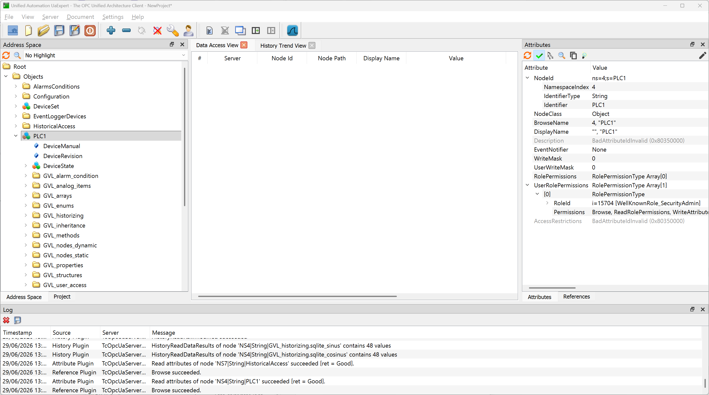
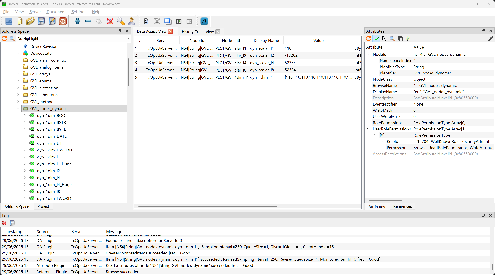
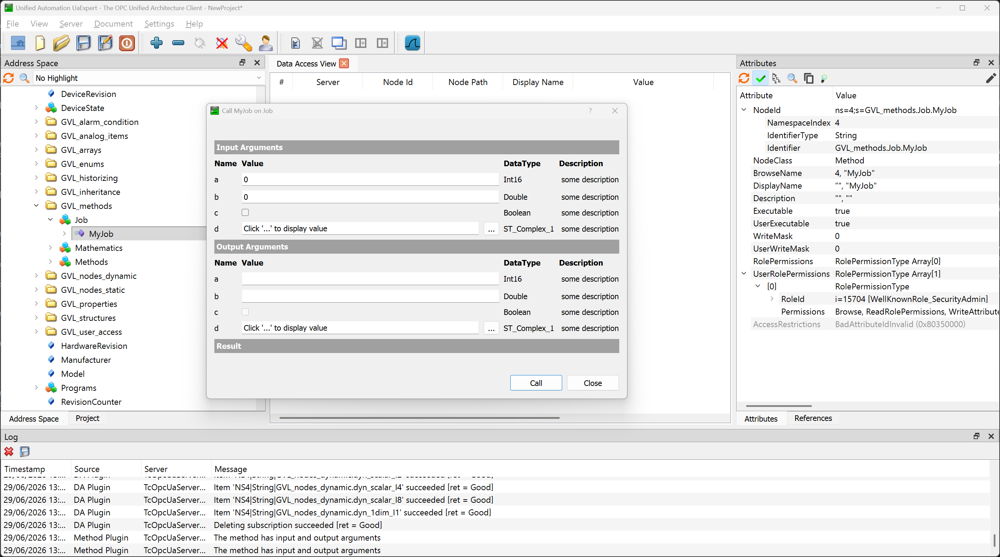
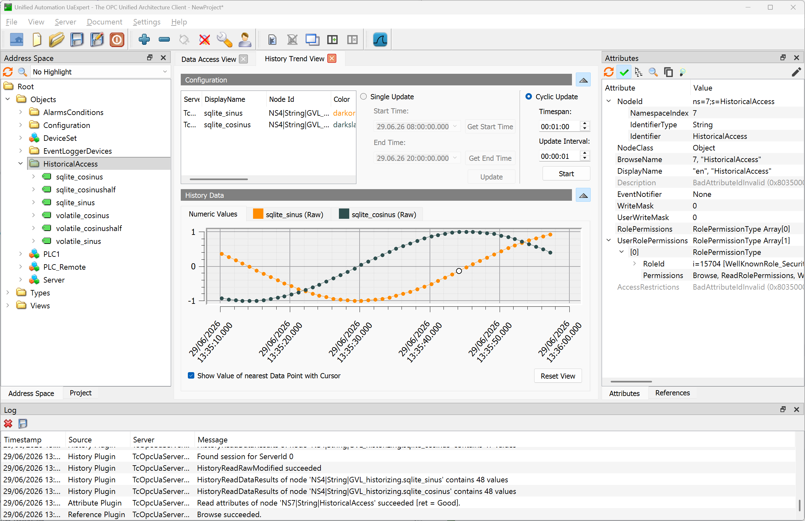
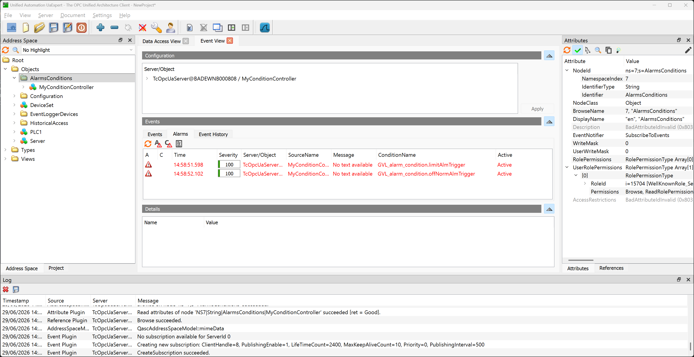

# TF6100 OPC UA Server Sample

## Overview
This TwinCAT 3 sample demonstrates how to expose PLC variables, methods and through the TwinCAT OPC UA server. 

In addition, configuration files for Historical Access and Alarms & Conditions are included in this sample.

The project is organized as a server-side data model with static data, dynamic data, method examples, event logging and historized data.

## What this sample demonstrates
- Publishing scalar, array, and structured PLC data through OPC UA
- Exposing analog items, enums, and complex structures
- Serving OPC UA methods with input, output, and in/out parameters
- Generating alarms and events from the TwinCAT Event Logger
- Updating data dynamically so OPC UA clients can observe changing values

## Prerequisites
- TwinCAT 3 XAE engineering environment installed on Windows
- TwinCAT 3 XAR runtime or compatible target system that can host the PLC project
- TF6100 TC3 OPC UA Server installation on your target system
- TC1200 PLC and TF6100 OPC UA license for the target runtime
- An OPC UA client for testing the exposed server endpoint, for example UA Expert from Unified Automation

> 7-day trial licenses are sufficient for testing this sample.

## Getting Started
1. Open the solution file [TF6100_OpcUa_Server_Sample.sln](TF6100_OpcUa_Server_Sample.sln).
2. Build and activate the project for your TwinCAT target.
3. Download the project to the target runtime and start the PLC.
4. Use an OPC UA client to connect to the server endpoint exposed by the target runtime.
5. Trust the server certificate on first connection if your client prompts for it.
6. Explore the static, dynamic, method, and event logger nodes from the client.

After connecting to the server, the OPC UA client should display an address space similar to the following:



> This screenshot has been taken based on the software UA Expert from Unified Automation

## Data Access
You can use an OPC UA client to read and write nodes in the server address space or to create subscriptions.

The folders `GVL_nodes_static` and `GVL_nodes_dynamic` contain simple variables and arrays. Variables and arrays in `GVL_nodes_static` are assigned a static value that is not changed cyclically by the PLC. These nodes are good for testing write operations. Variables and arrays in `GVL_nodes_dynamic` are changed cyclically by the PLC. These nodes can be used to test cyclic data updates and OPC UA subscriptions.



> This screenshot has been taken based on the software UA Expert from Unified Automation

## Methods
The sample also contains OPC UA method examples. These methods demonstrate how PLC methods can be exposed through the OPC UA Server and called from an OPC UA client.

Depending on the method, input and output parameters may be used.

You can find the methods defined in folder `GVL_methods`.



> This screenshot has been taken based on the software UA Expert from Unified Automation

### RPC methods
RPC methods are regular OPC UA methods that can be called directly by an OPC UA client. The method call is then executed synchronously by the server in the PLC and the result is returned to the client as part of the method call response.

It is important to understand that RPC methods are mapped directly to a PLC method and executed within the PLC cycle. This is sufficient for operation that can be finished within the PLC cylce. For longer operations, job methods have to be used. If you are unsure about the method execution time, we strongly recommend to use job methods instead of RPC methods.

In this sample, the objects `GVL_methods.Mathematics` and `GVL_methods.Methods` contain RPC methods.

### Job methods
In addition to regular RPC methods, the sample also contains examples for Job Methods. Job Methods are useful for operations that take longer than a PLC cycle.

Job methods are mapped to a PLC function block, which needs to have a specific signature and business logic in order to allow the server to execute a pre-defined handshake mechanism. This mechanism then informs the server when the PLC logic has finished the "method execution" and when the server can pass its results back to the OPC UA client. From the OPC UA client point-of-view, the method execution is a synchronous process.

The Job Method examples in this sample demonstrate how longer-running or stateful PLC operations can be exposed through the OPC UA Server in a structured way.

In this sample, the object `GVL_methods.Job` contains a job method.

> The OPC UA client will not see any difference when calling an RPC method or a job method. From the client perspective, it is a regular, synchronous method call.

## Historical Access
This sample includes support for OPC UA Historical Access.

To enable the Historical Access sample:

1. Copy the server configuration file `TcUaHaConfig.xml` to the TwinCAT OPC UA server configuration directory (usually located under `ProgramData`).
2. Edit the SQLite database path within the configuration file to match your system (default is `C:\Temp`).
3. Activate the sample project.
4. Restart the OPC UA server.

After server restart, HA-enabled nodes can be found in the address space under the folder `HistoricalAccess` and you can use an OPC UA Client of your choice to retrieve the historical data.



> This screenshot has been taken based on the software UA Expert from Unified Automation

## Alarms & Conditions

This sample includes support for OPC UA Alarms & Conditions.

To enable the Alarms & Conditions sample:

1. Copy the server configuration file `TcUaAcConfig.xml` to the TwinCAT OPC UA server configuration directory (usually located under `ProgramData`).
2. Activate the sample project.
3. Restart the OPC UA server.

After server restart, AC-enabled nodes can be found in the address space under the folder `AlarmsConditions` and you can use an OPC UA Client of your choice to subscribe to the condition controller within that folder.



> This screenshot has been taken based on the software UA Expert from Unified Automation

> Please note that this sample does not include any language resource files. Alarm texts will therefore display the message "No text available"

### OffNormalAlarmType
The variable `GVL_alarms_conditions.offNormAlmTrigger` is used to generate a simple Boolean test condition for an `OffNormalAlarmType`. A timer is used to periodically toggle the value between `TRUE` and `FALSE`. 

In this setup, the **normal condition** is when the variable is `TRUE`, which means the alarm is inactive. The **OffNormal condition** occurs when the value is `FALSE`, which means the alarm is active.

Whenever the timer elapses, the current value is inverted:

```iecst
GVL_alarm_condition.offNormAlmTrigger := NOT GVL_alarm_condition.offNormAlmTrigger;
```

This creates a repeating test sequence:

```text
FALSE, TRUE, FALSE, TRUE, ...
```

As a result, the corresponding OffNormal alarm condition is periodically entered and left. This allows OPC UA clients to observe both the activation and return-to-normal behavior of the alarm.

### LimitAlarmType
The variable `GVL_alarms_conditions.limitAlmTrigger` is used to generate a changing test value for limit alarm scenarios. The value is cyclically increased until it reaches the configured upper limit `nLimitAlarmTypeUpperLimit`. Once this limit is reached, the counting direction is changed and the value is decreased again until it reaches the configured lower limit (`nLimitAlarmTypeLowerLimit`).

This creates a repeating up/down ramp, for example:

```text
0, 1, 2, 3, ..., 9, 10, 9, 8, 7, ..., 1, 0, 1, ...
```

The Boolean variable `bCountUp` stores the current direction of the ramp:

* `TRUE`: `limitAlmTrigger` is incremented
* `FALSE`: `limitAlmTrigger` is decremented

The value is clamped at the upper and lower limits to avoid overshooting the configured range.

```iecst
IF bCountUp THEN
    limitAlmTrigger := limitAlmTrigger + 1;

    IF limitAlmTrigger >= nLimitAlarmTypeUpperLimit THEN
        limitAlmTrigger := nLimitAlarmTypeUpperLimit;
        bCountUp := FALSE;
    END_IF
ELSE
    limitAlmTrigger := limitAlmTrigger - 1;

    IF limitAlmTrigger <= nLimitAlarmTypeLowerLimit THEN
        limitAlmTrigger := nLimitAlarmTypeLowerLimit;
        bCountUp := TRUE;
    END_IF
END_IF
```

Depending on the current value of `limitAlmTrigger` and the configuration in `TcUaAcConfig.xml`, the limit alarm becomes active or inactive:

* The alarm is **active** when `limitAlmTrigger` reaches or exceeds the configured HiLimit or reaches or falls below the LoLimit.
* The alarm is **inactive** when `limitAlmTrigger` is within the normal operating range between these limits.

This mechanism is useful for test and demonstration purposes because it continuously moves the trigger value through the configured alarm range. OPC UA clients can observe how the exposed value changes over time and how the corresponding limit alarm states are entered and left.

## Notes & Troubleshooting
- The main PLC task runs `PRG_Static` once on startup and then calls `PRG_Dynamic`, `PRG_HistoricalAccess` and `PRG_Eventlogger` cyclically.
- If the OPC UA client reports `BadCertificateHostNameInvalid`, make sure the server certificate includes the hostname or IP address you are connecting to.
- The first client connection may require certificate trust or server initialization, depending on your TwinCAT and security settings.
- Make sure that the TF6100 OPC UA Server package is installed on the target system.

## Support
For questions about this sample, contact your local Beckhoff support team. 

Contact information is available on the official Beckhoff website at https://www.beckhoff.com/contact/.