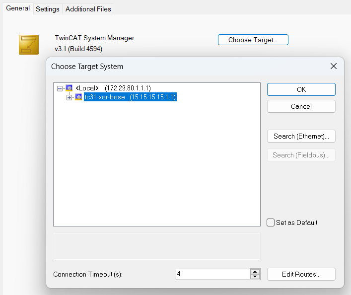
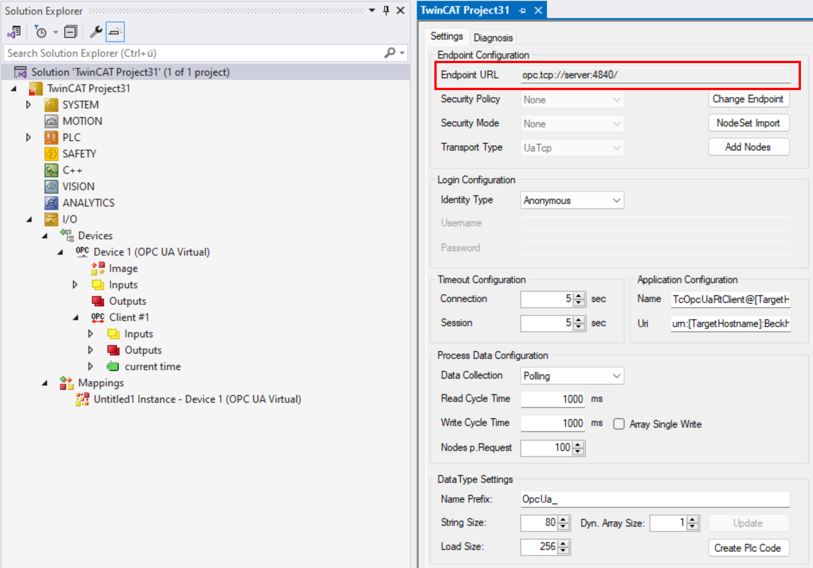
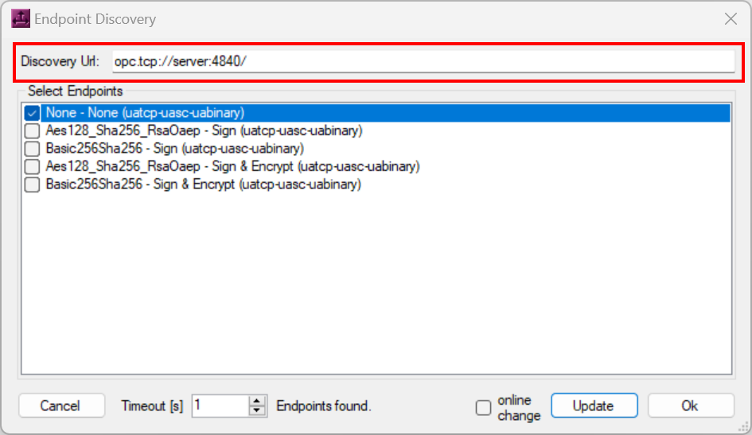
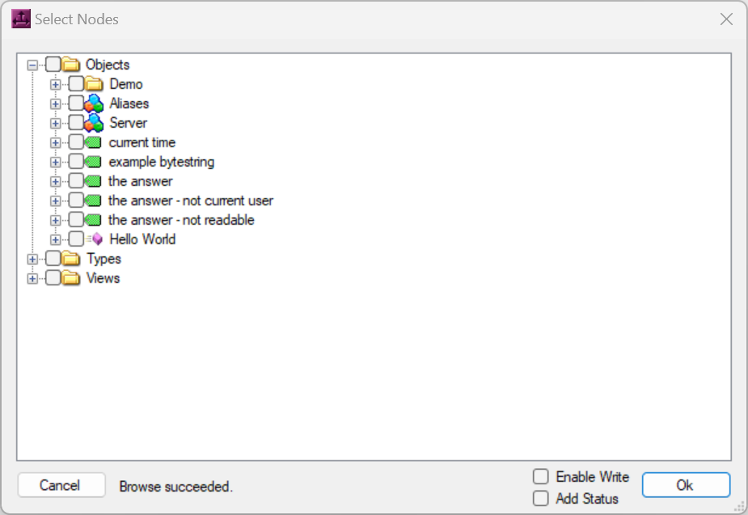

# About this Repository

This repository provides a step-by-step guide to build and deploy a containerized TwinCAT 3.1 XAR runtime environment that also includes the TwinCAT OPC UA Client using Docker on a Beckhoff IPC.

With this sample, you will learn how to:

- Build and configure a TwinCAT XAR container image that also includes the TwinCAT OPC UA Client.
- Set up secure communication between Engineering and Runtime using ADS-over-MQTT.
- Set up firewall permissions for OPC UA communication between client and server.
- Manage containers with Docker Compose and Makefile automation.
- Connect to the containerized TwinCAT runtime with TwinCAT Engineering.
- Using the TwinCAT OPC UA Client to connect to a server.

Here’s a high-level overview of what the completed setup will look like:


## How to get support

Should you have any questions regarding the provided sample code, please contact your local Beckhoff support team. Contact information can be found on the official Beckhoff website at https://www.beckhoff.com/contact/.

## Using the sample

Before you begin, please make sure that your environment meets the following prerequisites:

- [Setup and Install](https://infosys.beckhoff.com/english.php?content=../content/1033/beckhoff_rt_linux/17350447499.html) the Beckhoff Real-Time Linux® Distribution on a supported IPC.
- [Configure access to Beckhoff package server](https://infosys.beckhoff.com/english.php?content=../content/1033/beckhoff_rt_linux/17350408843.html)
- Install [Docker Engine on Debian](https://docs.docker.com/engine/install/debian/#install-using-the-repository)
- Run the following command to install the TwinCAT System Configuration tools and make on the host: `sudo apt install --yes make tcsysconf`

You may then continue with the individual chapters of this sample. It is best practice to copy the samples folder (`tcopcuaclientpubsub-container-sample`) to a directory on your Beckhoff Real-Time Linux® host system and connect to that system via SSH to work with the sample. For simplicity reasons, this directory may be `/home/Administrator`, but it can be any directory on the host.

Once the prerequisites are in place, you can continue with the following steps to build and deploy the container.

1. **Build the container image**

During the image build process, TwinCAT for Linux® is downloaded from `https://deb.beckhoff.com`. To access the package server, please replace `<mybeckhoff-mail>` and `<mybeckhoff-password>` in `./tc31-opc-ua-clientpubsub/apt-config/bhf.conf` with valid myBeckhoff credentials.

Furthermore, please ensure that the file `./tc31-opc-ua-clientpubsub/apt-config/bhf.list` contains the correct Debian distribution codename of the current suite (e.g. `trixie-unstable` for beta versions).

Afterwards, navigate to the `tc31-opc-ua-clientpubsub` directory and execute the following command:

```bash
sudo docker build --secret id=apt,src=./apt-config/bhf.conf --network host -t tc31-opc-ua-clientpubsub .
```

Alternatively, the included `Makefile` can be used as wrapper for the most frequently used `docker` commands:

```bash
sudo make build-image
```

2. **Set up firewall rules for MQTT**

This sample will make use of **ADS-over-MQTT** for the communication between TwinCAT Engineering and TwinCAT XAR containers.

To establish an ADS-over-MQTT connection between Engineering and Runtime, you need to allow incoming connections to the MQTT port. This requires to configure the firewall of the host system. Beckhoff Real-Time Linux® uses nftables as its default firewall framework. To set up an nftables rule for the message broker, please create a corresponding configuration file that represents this rule:

```
sudo nano /etc/nftables.conf.d/60-mosquitto-container.conf
```

Then copy the following code snippet into that file:

```nft
table inet filter {
  chain input {
    tcp dport 1883 accept
  }
  chain forward {
    type filter hook forward priority 0; policy drop;
    tcp sport 1883 accept
    tcp dport 1883 accept
  }
}
```

Save the file by pressing <kbd>Ctrl</kbd>+<kbd>o</kbd> and <kbd>Enter</kbd>.
Then close the editor via <kbd>Ctrl</kbd>+<kbd>x</kbd> and <kbd>Enter</kbd>.

Apply the rule by executing the following command on the terminal:

```bash
sudo nft -f /etc/nftables.conf.d/60-mosquitto-container.conf
```

3. **Set up firewall rules for OPC UA**

This sample includes an OPC UA Server, which is instantiated as a separate container and can be accessed by the TwinCAT OPC UA Client.

To allow OPC UA communication between the containers, you need to enable the corresponding OPC UA port in the firewall of the host system. Beckhoff Real-Time Linux® uses nftables as its default firewall framework. To set up an nftables rule for the OPC UA Server, please create a corresponding configuration file that represents this rule:

```
sudo nano /etc/nftables.conf.d/70-opc-ua-server-container.conf
```

Then copy the following code snippet into that file:

```nft
table inet filter {
  chain input {
    tcp dport 4840 accept
  }
  chain forward {
    type filter hook forward priority 0; policy drop;
    tcp sport 4840 accept
    tcp dport 4840 accept
  }
}
```

Save the file by pressing <kbd>Ctrl</kbd>+<kbd>o</kbd> and <kbd>Enter</kbd>.
Then close the editor via <kbd>Ctrl</kbd>+<kbd>x</kbd> and <kbd>Enter</kbd>.

Apply the rule by executing the following command on the terminal:

```bash
sudo nft -f /etc/nftables.conf.d/70-opc-ua-server-container.conf
```

4. **Start the containers**

The sample includes a Docker Compose file (`docker-compose.yml`) to simplify the process of creating containers and their configuration, including network settings and volumes as well as any additional parameters like port mappings or environmental variables. Using the Docker Compose file, you can specify which "services" should be set up. Services are named definitions of a container (or a group of containers) and define how they should be run. In this sample, we want to start the following services:

- A container instance for the Mosquitto Message Broker
- A container instance for our custom `tc31-opc-ua-clientpubsub` image
- A container instance for the OPC UA Server

**Make sure that the network settings do not conflict with any existing containers or networks defined on your host.** This might be the case if you have tried other samples before and if the corresponding containers are still running. If this is the case, adapt the Docker Compose file accordingly, for example by using different IP addresses (ipv4_address) for the containers or also by removing not required containers from the Docker Compose file (for example if you already have a container for the Mosquitto message broker). Also make sure that each runtime container has a unique AMS Net ID by configuring the corresponding environment variable (AMS_NETID).

You can use the following command to setup the containers based on the Docker Compose file:

```bash
sudo docker compose up -d
```

You can verify that all containers have been started successfully by executing the following command:

```bash
sudo docker ps
```

You should see three running container instances (`mosquitto`, `tc31-opc-ua-clientpubsub` and `server`). You can also reduce the default output of this command to only include relevant information, for example:

```bash
sudo docker ps --format "table {{.Names}}\t{{.Status}}\t{{.Image}}\t{{.Ports}}"
```

5. **Configure ADS-over-MQTT connections**

To connect your TwinCAT Engineering system via ADS-over-MQTT with the containerized TwinCAT runtime, please use the `mqtt.xml` template file, which represents an ADS-over-MQTT configuration file. In this file, please replace the placeholder `ip-address-of-container-host` with the actual **IP address of the Docker host**.
Copy the adjusted file to the following directory on your TwinCAT Engineering system:

```
C:\Program Files (x86)\Beckhoff\TwinCAT\3.1\Target\Routes\
```

Afterwards, restart (a "re-config" is sufficient) the TwinCAT System Service via the system tray context menu.
The containerized TwinCAT runtime should now appear as an available target system in TwinCAT Engineering.



6. **Use TwinCAT OPC UA Client to connect to the server**

You can now use the TwinCAT OPC UA Client in the same way as if it had been installed on a regular IPC. Simply connect the TwinCAT Engineering environment to the containerized runtime and start using the client, for example by adding a TwinCAT OPC UA Client I/O device.  

To test your setup, you could either instantiate a TwinCAT OPC UA Server in a separate Docker container (see separate sample) or install it directly on the Beckhoff RT Linux host. Make sure to configure the nftables firewall so that incoming connections to the server are not blocked.

In this sample we have created an additional container which hosts a sample server application based on the Open62541 framework. The creators of Open62541 are also maintaining a Docker image on Docker Hub, which can be found [here](https://hub.docker.com/r/open62541/open62541). Additional information about the Open62541 framework can be found on the official [Open62541 website](https://www.open62541.org).

The Open62541 container image automatically starts a server application when instantiated. For the TwinCAT OPC UA Client container, this server application is reachable under the following ServerURL:

```
opc.tcp://server:4840
```

As an alternative, you can also connect to the server container's IP address instead, which has been configured as part of the Docker Compose file.

```
opc.tcp://192.168.20.4:4840
```

The following screenshots show the TwinCAT OPC UA Client when connecting to the server by using the container's hostname.

**Connection dialog**


**Endpoint selection dialog**


**Node selection dialog**
