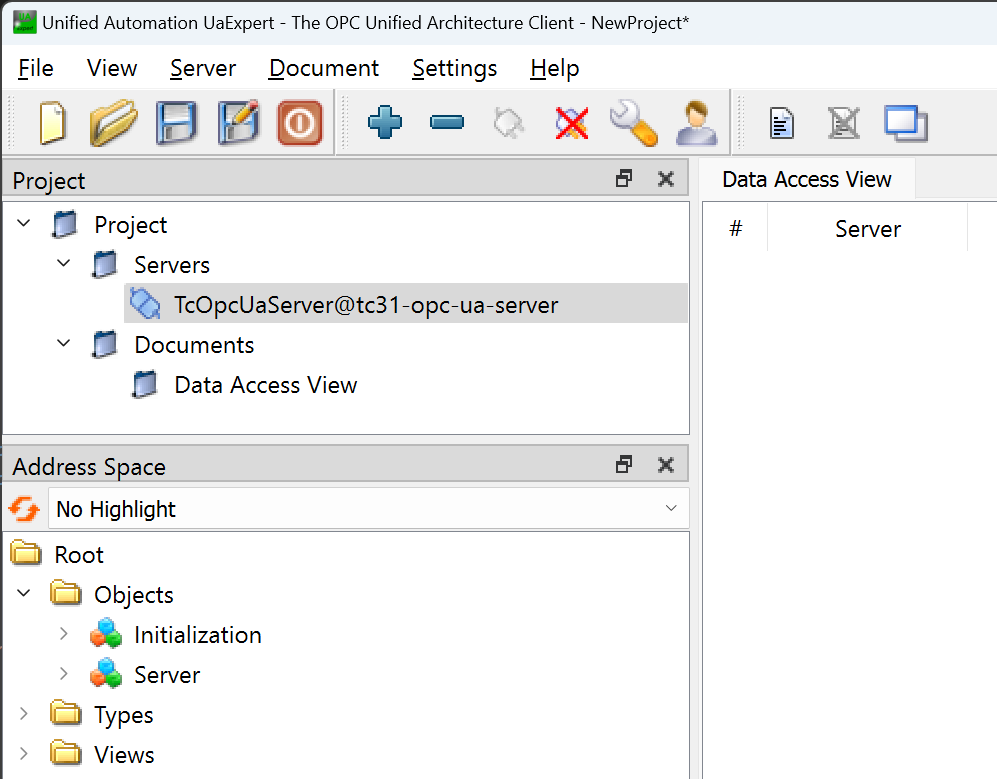
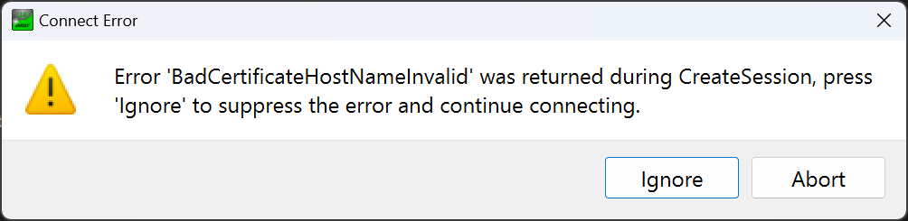
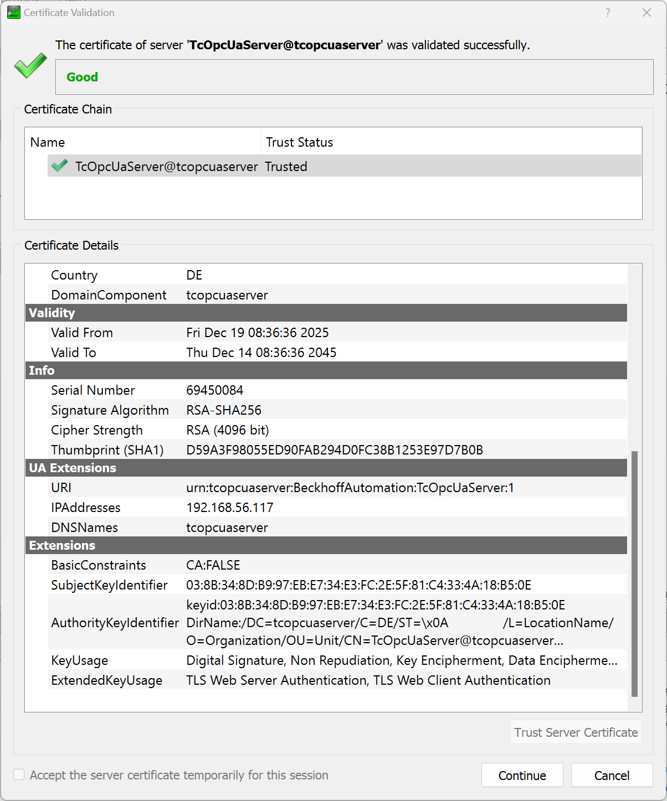

# About this Repository

This repository provides a step-by-step guide to build and deploy a containerized TwinCAT 3.1 XAR runtime environment that also includes the TwinCAT OPC UA Server using Docker on a Beckhoff IPC.

With this sample, you will learn how to:

- Build and configure a TwinCAT XAR container image that also includes the TwinCAT OPC UA Server.
- Set up secure communication between Engineering and Runtime using ADS-over-MQTT.
- Manage containers with Docker Compose and Makefile automation.
- Connect to the containerized TwinCAT runtime with TwinCAT Engineering.
- Connect to the server using an OPC UA client.

Here’s a high-level overview of what the completed setup will look like:


## How to get support

Should you have any questions regarding the provided sample code, please contact your local Beckhoff support team. Contact information can be found on the official Beckhoff website at https://www.beckhoff.com/contact/.

## Prepare server configuration files

For your convenience, we have placed a set of server configuration files under the directory `./tc31-opc-ua-server/configs`. Make sure to update these configuration files with the latest available versions, e.g. from a regular setup installation. Per default, the server uses its execution directory (the same directory as the server executable is stored in) to store these files. By using the file `./tc31-opc-ua-server/configs/location/TcUaConfigLocation.xml`, the server can be configured to use a different folder instead, for example the sub folder `configs`, to look for its configuration files. This folder is then mapped to the folder  `./tc31-opc-ua-server/configs` on the host system when setting up the Docker container.

## Using the sample

Before you begin, please make sure that your environment meets the following prerequisites:

- [Setup and Install](https://infosys.beckhoff.com/english.php?content=../content/1033/beckhoff_rt_linux/17350447499.html) the Beckhoff Real-Time Linux® Distribution on a supported IPC.
- [Configure access to Beckhoff package server](https://infosys.beckhoff.com/english.php?content=../content/1033/beckhoff_rt_linux/17350408843.html)
- Install [Docker Engine on Debian](https://docs.docker.com/engine/install/debian/#install-using-the-repository)
- Run the following command to install the TwinCAT System Configuration tools and make on the host: `sudo apt install --yes make tcsysconf`

You may then continue with the individual chapters of this sample. It is best practice to copy the samples folder (`tcopcuaserver-container-sample`) to a directory on your Beckhoff Real-Time Linux® host system and connect to that system via SSH to work with the sample. For simplicity reasons, this directory may be `/home/Administrator`, but it can be any directory on the host.

Once the prerequisites are in place, you can continue with the following steps to build and deploy the container.

1. **Build the container image**

During the image build process, TwinCAT for Linux® is downloaded from `https://deb.beckhoff.com`. To access the package server, please replace `<mybeckhoff-mail>` and `<mybeckhoff-password>` in `./tc31-opc-ua-server/apt-config/bhf.conf` with valid myBeckhoff credentials.

Furthermore, please ensure that the file `./tc31-opc-ua-server/apt-config/bhf.list` contains the correct Debian distribution codename of the current suite (e.g. `trixie-unstable` for beta versions).

Afterwards, navigate to the `tc31-opc-ua-server` directory and execute the following command:

```bash
sudo docker build --secret id=apt,src=./apt-config/bhf.conf --network host -t tc31-opc-ua-server .
```

Alternatively, the included `Makefile` can be used as wrapper for the most frequently used `docker` commands:

```bash
sudo make build-image
```

2. **Set up firewall rules for MQTT and OPC UA**

This sample will make use of **ADS-over-MQTT** for the communication between TwinCAT Engineering and TwinCAT XAR containers. In addition, communication to the default OPC UA server port (4840/tcp) needs to be enabled in order to allow OPC UA clients to connect to the containerized server.

To establish an ADS-over-MQTT connection between Engineering and Runtime, you need to allow incoming connections to the MQTT port. This requires to configure the firewall of the host system. Beckhoff Real-Time Linux® uses nftables as its default firewall framework. To set up an nftables rule for the message broker, please create a corresponding configuration file that represents this rule:

```
sudo nano /etc/nftables.conf.d/60-mosquitto-container.conf
```

Then copy the following code snippet into that file:

```nft
table inet filter {
  chain input {
    tcp dport 1883 accept
  }
  chain forward {
    type filter hook forward priority 0; policy drop;
    tcp sport 1883 accept
    tcp dport 1883 accept
  }
}
```

Save the file by pressing <kbd>Ctrl</kbd>+<kbd>o</kbd> and <kbd>Enter</kbd>.
Then close the editor via <kbd>Ctrl</kbd>+<kbd>x</kbd> and <kbd>Enter</kbd>.

To establish an OPC UA connection with the server, you need to allow incoming connections to the OPC UA port of the server. To set up an nftables rule for the server, please create a corresponding configuration file that represents this rule:

```
sudo nano /etc/nftables.conf.d/70-tcopcuaserver-container.conf
```

Then copy the following code snippet into that file:

```nft
table inet filter {
  chain input {
    tcp dport 4840 accept
  }
  chain forward {
    type filter hook forward priority 0; policy drop;
    tcp sport 4840 accept
    tcp dport 4840 accept
  }
}
```

Save the file by pressing <kbd>Ctrl</kbd>+<kbd>o</kbd> and <kbd>Enter</kbd>.
Then close the editor via <kbd>Ctrl</kbd>+<kbd>x</kbd> and <kbd>Enter</kbd>.

Apply the rules by executing the following command on the terminal:

```bash
sudo nft -f /etc/nftables.conf.d/60-mosquitto-container.conf
sudo nft -f /etc/nftables.conf.d/70-tcopcuaserver-container.conf
```

3. **Start the containers**

The sample includes a Docker Compose file (`docker-compose.yml`) to simplify the process of creating containers and their configuration, including network settings and volumes as well as any additional parameters like port mappings or environmental variables. Using the Docker Compose file, you can specify which "services" should be set up. Services are named definitions of a container (or a group of containers) and define how they should be run. In this sample, we want to start the following services:

- A container instance of the Mosquitto Message Broker
- A container instance of our custom `tc31-opc-ua-server` image

You can use the following command to setup the containers based on the Docker Compose file:

```bash
sudo docker compose up -d
```

You can verify that all containers have been started successfully by executing the following command:

```bash
sudo docker ps
```

You should see two running container instances (`mosquitto` and `tc31-opc-ua-server`). You can also reduce the default output of this command to only include relevant information, for example:

```bash
sudo docker ps --format "table {{.Names}}\t{{.Status}}\t{{.Image}}\t{{.Ports}}"
```

4. **Configure ADS-over-MQTT connections**

To connect your TwinCAT Engineering system via ADS-over-MQTT with the containerized TwinCAT runtime, please use the `mqtt.xml` template file, which represents an ADS-over-MQTT configuration file. In this file, please replace the placeholder `ip-address-of-container-host` with the actual **IP address of the Docker host**.
Copy the adjusted file to the following directory on your TwinCAT Engineering system:

```
C:\Program Files (x86)\Beckhoff\TwinCAT\3.1\Target\Routes\
```

Afterwards, restart (a "re-config" is sufficient) the TwinCAT System Service via the system tray context menu.
The containerized TwinCAT runtime should now appear as an available target system in TwinCAT Engineering.


5. **Connect an OPC UA client**

You can now use any OPC UA client to connect to the containerized server. The server is reachable under the IP address of the host computer. Note that the regular server initialization steps apply when connecting to the server for the first time. For more information about the server initialization, please consult our [official product documentation](https://infosys.beckhoff.com/content/1033/tf6100_tc3_opcua_server/index.html?id=5193389037403363859) on the Beckhoff Information System.

```
opc.tcp://<IP-Address-of-Host>:4840
```



Please note that, depending on which OPC UA client you use, you may receive an error message `BadCertificateHostNameInvalid` when connecting to the server.



`BadCertificateHostNameInvalid` is an OPC UA security error that means that the hostname (or IP address) you are connecting to does not match the hostname information in the server’s certificate. When an OPC UA client connects securely to a server, it verifies the server’s certificate. In this verification, the endpoint URL hostname must match one of the names listed in the server certificate - either in the Subject Alternative Name (SAN) or the Common Name (CN). If they don’t match, the client rejects the connection and raises this error. In our case, this is due to the fact that we have connected to the server by using an IP address because the container's hostname does not resolve from outside the container environment. However, the server certificate is issued for this hostname per default.

You can optimize this behavior either by making the container hostname resolveable from outside the container environment or  by modifying the configuration file `TcUaServerConfig.xml` to use a different name than the actual hostname (for example a name that resolves via a DNS server) or the IP address when creating the certificate. 

The following configuration file entry is responsible for changing which information is added to the server certificate and you can modify the hostname (or add additional ones) and IP addresses under which the server is reachable and that should be added to the server's certificate.

```xml
<CertificateSettings>
    <CommonName>[ServerName]</CommonName>
    <Organization>Organization</Organization>
    <OrganizationUnit>Unit</OrganizationUnit>
    <Locality>LocationName</Locality>
    <State></State>
    <Country>DE</Country>
    <YearsValidFor>20</YearsValidFor>
    <KeyLength>4096</KeyLength>
    <CertificateType>RsaSha256</CertificateType>
    <DNSName>[NodeName]</DNSName>
    <!--<IPAddress></IPAddress>-->
</CertificateSettings>
```
**XPath:** `/OpcServerConfig/UaServerConfig/UaEndpoint/CertificateStore/CertificateSettings`

If you want to add the IP address under which the server is reachable, you need to uncomment the corresponding XML node and add the server's IP address. Please note that this makes only sense when using a static IP address under which the server is reachable.

After making these changes, please make sure to remove any existing server certificate so that new certificates are created when restarting the server. To remove the server certificate, you need to remove the following two files:

```
PKI/CA/own/certs/Beckhoff_OpcUaServer.der
PKI/CA/own/private/Beckhoff_OpcUaServer.pem
```

You then need to restart the server in order to create a new server certificate. You can do this for example by restarting the Docker container:

```
sudo docker container restart tc31-opc-ua-server
```

Upon reconnecting the OPC UA client to the server, the corresponding changes are reflected in the server’s certificate, and certificate validation succeeds.

